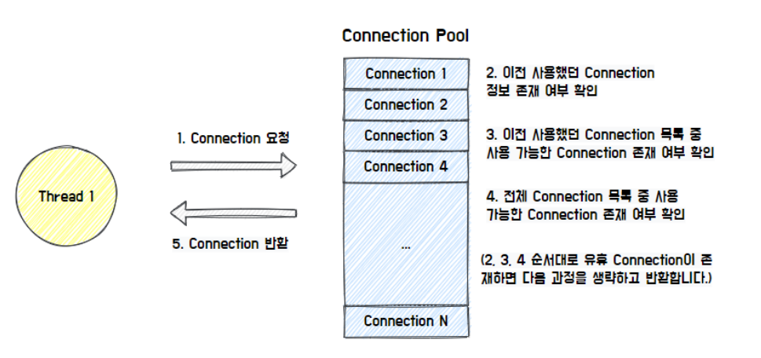
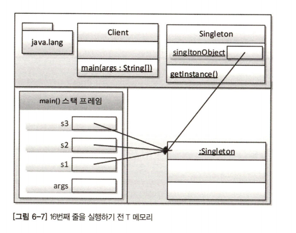
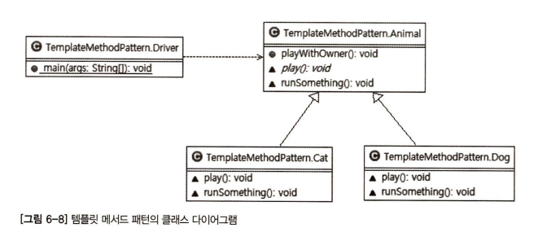
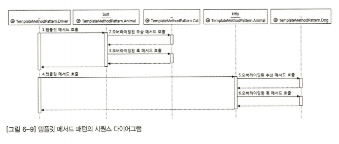
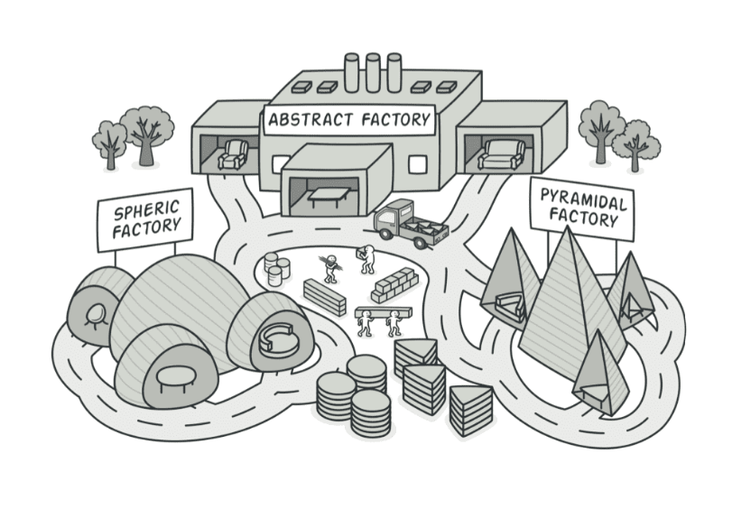
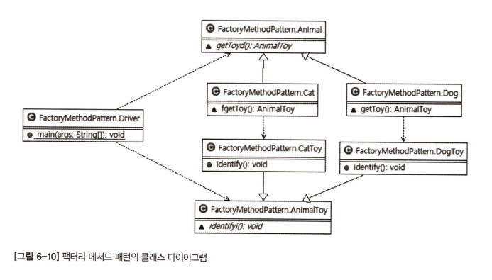
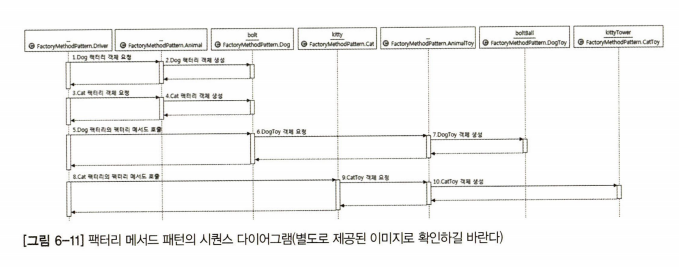
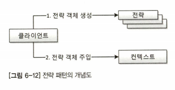
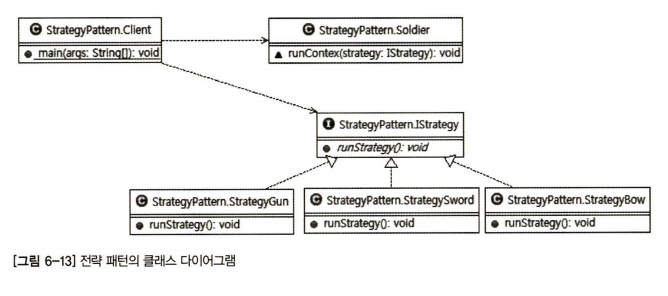
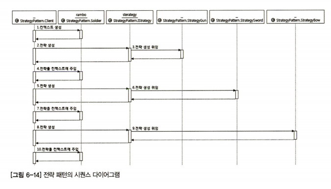

## 📌 목차

- 디자인패턴 개요
- 디자인패턴 종류
  - 어댑터 패턴
  - 프록시 패턴
  - 데코레이션 패턴
  - 싱글턴 패턴
  - 템플릿 메서드 패턴
  - `팩터리 메서드 패턴`
  - 전략 패턴
  - 템플릿 콜백 패턴
  - 스프링이 사랑한 다른 패턴들(마무리)

## 01. 스프링이 사랑한 디자인패턴


> 현재까지는 OOP의 4대 특성과 5대 원칙에 대해 진행 하였습니다

1. 객체 지향의 4대 특성
2. SOLID 5대 원칙
3. `디자인패턴` 🚀

**객체 지향 특성**은 **도구**, **설계 원칙**은 **도구를 올바르게 사용하는 방법**이다.  
그렇다면, 디자인패턴은 무엇에 비유할 수 있을지 아래 표를 살펴보자.

| 요리                                | 객체 지향 프로그래밍                   |
| ----------------------------------- | -------------------------------------- |
| **요리도구**                        | 4대 원칙(상속, 추상화, 다형성, 캡슐화) |
| **요리도구 올바르게 사용하는 방법** | 5대 설계 원칙(SOLID)                   |
| `레시피`                            | 디자인 패턴                            |

## 01-1. 디자인패턴이란?


- 하나의 요리에 대한 표준화 된 방식이 존재.
- 프로그램을 작성하다보면 `비슷한 상황`을 직면하게 됨
- 이러한 상황에서 이전의 많은 개발자들이 고민하고 정제한 `표준 설계 패턴`를 의미

> 즉, 실제 개발 현장에서 다양한 요구사항을 프로그래밍으로 처리하면서 만들어진 다양한 해결책 중  
> 많은 사람들이 인정한 **Best Practice**를 정리한 것.

## 01-2. 스프링 프레임워크(Spring Framework)

> 스프링 프레임워크를 설명하는 공식정인 정의

- 자바 엔터프라이즈 개발을 편하게 해주는 **Open source application framework**
- **OOP 프레임워크**
- `스프링`은 `객체 지향`의 `특성과 설계 원칙`을 `극한`까지 적용한 프레임워크

## 02. 어댑터 패턴(Adapter Pattern)


> 💡 개발 폐쇄 원칙을 활용한 설계 패턴, **객체를 속성으로 만들어 참조하는 디자인 패턴**

- 어댑터를 번역하면 `변환기`
- **서로 다른 두 인터페이스 사이에 통신을 가능하게 함**
- 대표적으로는 `휴대폰 충전기`가 존재
- 다양한 DataBase를 조작할 수 있는 인터페이스
  - ODBC(Open Database Connectivity), JDBC(Java Database Connectivity)
  - JRE

## 02-1. 어댑터 패턴

```java
// Before : Class ServiceA
public class ServiceA {
    void runServiceA() {
        System.out.println("ServiceA");
    }
}
```

```java
// Before : Class ServiceA
public class ServiceB {
    void runServiceB() {
        System.out.println("ServiceB");
    }
}
```

```java
// Before: Class ClientWithNoAdapter
public class ClientWithNoAdapter {

    public static void main(String[] args) {
        ServiceA sa1 = new ServiceA(); // 1. 객체 생성
        ServiceB sb1 = new ServiceB(); // 2. 객체 생성

        sa1.runServiceA(); // 3. sa1.runServiceA() 호출
        sb1.runServiceB(); // 4. sa1.runServiceB() 호출
    }
}
```

- 현재 sa1, sb1 참조 변수를 통해 runServiceA(), runServiceB() 메서드 호출
- 비슷한 일을 하지만 메서드명만 다른 것을 확인 가능

### 02-2. 시퀸스 다이어그램(Sequence Diagram)


### 02-3. 어댑터 패턴 적용 후

```java
// After: Class AdapterServiceA
public class AdapterServiceA {
    ServiceA sa1 = new ServiceA();

    void runService() {
        sa1.runServiceA();
    }
}
```

```java
// After: Class AdapterServiceB
public class AdapterServiceB {
    ServiceA sb1 = new ServiceB();

    void runService() {
        sb1.runServiceB();
    }
}
```

```java
// After: Class ClientWithAdapter
public class ClientWithAdapter {

    public static void main(String[] args) {
        AdapterServiceA asa1 = new AdapterServiceA();
        AdapterServiceB asb1 = new AdapterServiceB();

        asa1.runService();
        asb1.runService();
    }
}
```

- 클라이언트(ClientWithAdapter)가 변환기를 통해 동일한 메서드인 runService() 호출
- 즉, 직접 ServiceA, ServiceB의 메서드를 호출하는 것이 아닌 어댑터 객체를 통해 접근

### 02-4. 시퀸스 다이어그램(Sequence Diagram)


- 어댑터 패턴 `합성`, 즉 객체를 속성으로 만들어서 참조하는 디자인 패턴
- 호출 당하는 쪽의 메서드(**runServiceA**)를 중간 변환기(**AdapterServiceA**)를 통해 호출하는 패턴

## 03. 프록시 패턴(Proxy Pattern)


> 개방 폐쇄 원칙과 의존 역전 법칙이 녹아들어 있는 프록시 패턴

- 프록시는 대리자, 대변인의 뜻을 가진 단어
- 디자인 패턴에서는 대리자/대변인을 프록시 패턴으로 표현


- ClientWithNoProxy가 대리자(**프록시 객체**)없이 Service 객체의 runSomething() 직접 호출

### 03-1. 프록시 패턴 적용 전

```java
// Before: Class Service
public class Service {

    public String runSomething() {
        return "서비스를 실행합니다.";
    }
}
```

```java
// Before: Class ClientWithNoProxy
public class ClientWithNoProxy {

    public static void main(String[] args) {
        // 프록시를 이용하지 않은 호출
        Service service = new Service(); // 결합도 역시 올라감
        System.out.println(service.runSomething);
    }
}
```

- ClientWithNoProxy 클래스에서 Service 클래스의 메서드를 직접 호출
- 위와 같은 코드를 A(ClientWithNoProxy) 가 B에 의존한다 할 수 있다

### 03-2. 프록시 패턴


> 프록시 패턴을 사용하기 위한 절차

- 프록시 패턴의 경우 **실제 서비스 객체가 가진 메서드와 같은 이름의 메서드**를 사용
  - 이를 위해서 인터페이스 사용
- 인터페이스를 사용하면 서비스 객체가 들어갈 자리에 대리자 객체가 투입됨
- **클라이언트는 서비스 객체를 호출하는지, 대리자 객체를 호출하는지 알 수가 없다**

### 03-3. 시퀸스 다이어그램


### 03-4. 프록시 패턴 적용 후

```java
// After: Interface IService
public interface IService {
    String runSomething();
}
```

```java
// After: Class Service
public class Service implements IService {

    @Overried
    public String runSomething() {
        return "서비스를 실행합니다.";
    }
}
```

```java
// After: Class Proxy
// @desc : 💡 중간 대리자의 역할을 수행, 호출에 대한 변경이 아닌 제어가 주 목적이다
public class Proxy implements IService {
    IService service; // 인터페이스 IService의 참조 변수를 맴버로 갖는다

    @Overried
    public String runSomething() {
        System.out.println("호출에 대한 흐름 제어가 주목적, 반환 결과를 그대로 전달")

        // Bussiness Logic 수행 가능

        service = new Service();
        return service.runSomething();
    }
}
```

```java
// After: Class ClientWithProxy
public class ClientWithProxy {

    public static void main(String[] args) {
         // 다형성, 부모 객체로 자식 객체를 받음
         // ex) List<String> list = new ArrayList<>();
        IService proxy = new Proxy();
        System.out.println(proxy.runSomething());
    }
}
```

> 대리자의 역할, 여기서는 Proxy 클래스가 된다

1. 서비스와 같은 이름의 메서드 구현, 이때 인터페이스 사용
2. 실제 서비스에 대한 참조 변수를 갖음(**합성**)
3. 실제 서비스와 같은 이름을 가진 메서도 호출, 그 값을 반환
4. 실제 서비스의 **메서드 호출 전후에 별도의 로직 수행 가능**

### 한줄 정리

> ⭐ **제어 흐름을 조정하기 위한 목적으로 중간에 대리자를 두는 패턴**

## 04. 데코레이터 패턴(Decorator Pattern)


- 데코레이터는 **도장**, **도배업자**, `장식자`의 뜻을 가진 단어
- 즉, `원본에 어떠한 장식을 더하는 패턴`이라는 것이 이름에서 들어남
- 프록시 패턴과 구현 방법이 같으나, `클라이언트의 최종 반환값을 조작`

### 04-1. 프록시 패턴과 데코레이터 패턴 비교

- `프록시 패턴`
  - 제어의 흐름을 변경하거나 별도의 로직 처리 목적
  - 클라이언트의 반환 값을 특별한 경우가 아니면 변경하지 않음
- `데코레이터 패턴`
  - 클라이언트가 받는 반환값에 장식을 더한다
  - 즉, `return 값을 핸들링 한다는 의미`

### 04-2. 데코레이터 패턴 적용

```java
// Interface Iservice
public Interface IService {
    public abstract String runSomething();
}
```

```java
// Class Service
public class Service implements IService {

    @Overried
    public String runSomething() {
        return "추상 메서드 runSomething 호출!";
    }
}
```

```java
// Class Decoreator
public class Decoreator implements IService {
    IService service; // interface ref variable

    public String runSomething() {
        // System.out.println("호출에 대한 흐름 제어가 주목적, 반환 결과를 그대로 전달") // Proxy
        System.out.println("호출에 대한 장식이 목적, 클라이언트에게 반환 결과에 장식을 더하여 전달");

        service = new Service();

        // 유저의 반환 값을 데코레이터 단에서 핸들링
        return "정말" + service.runSomething();
    }
}
```

```java
// Class Decoreator
public class ClientWithDecorator {

    public static void main(String[] args) {
        // 상위 인터페이스로 하위 Decorator 객체를 받는다
        IService decorator = new Decoreator();

        // How to call method?
        //  ㄴ decorator.runSomthine
        //      ㄴ service.runSomthine
        System.out.println(decorator.runSomething());
    }
}
```

> Class : Decorator => '장식자', Service => '서비스'

1. 장식자는 실제 서비스와 `같은 이름의 메서드` 구현, 이 때 인터페이스 사용
2. 장식자는 실제 서비스에 대한 `참조 변수`를 갖는다(합성)
3. 장식자는 `실제 서비스와 같은 이름을 가진 메서드 호출, 반환값을 조작 후 반환`
4. 장식자는 실제 서비스의 메서드 `호출 전후에 비즈니스 로직 수행` 가능

### 한줄 정리

> ⭐ 메서드 호출의 반환값에 변화를 주기 위해 중간에 장식자(Decorator)를 두는 패턴

## 05. 싱글턴 패턴(Singleton Pattern)



- `인스턴스를 하나만 만들어 사용하기 위한 패턴. `
- **Connection pool**, **Thread pool**은 인스턴스를 여러개를 만들면 불필요한 자원 사용.
  - 프로그램이 예상치 못한 결과를 낳을 수 있음.

### 05-1. 싱글턴 패턴 적용을 위한 제약

> 싱글턴 패턴은 오직 인스턴스를 하나만 만들고 그것을 계속해서 재사용한다  
> 싱글턴 패턴을 적용할 경우 의미상 두 개의 객체가 존재할 수 없다

1. 객체 생성을 위한 **new 키워드**에 제약을 걸어야 함
2. 유일한 단일 객체를 반환할 수 있는 정적 메서드(**static method**) 필요
3. 유일한 단일 객체를 참조할 정적 참조 변수(**static variable**)가 필요

### 05-2. 싱글턴 패턴 적용

```java
// Class Singleton
public class Singleton {
    static Singleton singletonObj; // static reference variable

    // private constructor
    private Singleton() { };

    // return singletonObj
    public static Singleton getInstance() {
        if (singletonObj == null) {
            singletonObj = new Singleton();
        }
        return singletonObj;
    }
}
```

```java
// Class Client
public class Client {

    public static void main(String[] args) {
        // The constructor Singleton() is not visible
        // Singleton singleton = new Singleton();

        Singleton s1 = Singleton.getInstance();
        Singleton s2 = Singleton.getInstance();
        Singleton s3 = Singleton.getInstance();

        System.out.println(s1);
        System.out.println(s2);
        System.out.println(s3);

        s1 = null;
        s2 = null;
        s3 = null;
    }
}
```

### 05-3. 메모리 구조 확인



- 4개의 참조변수가 하나의 단일 객체를 참고
- `단일 객체`인 경우 공유 객체로 사용되기 때문에 `속성을 갖지 않는게 정석`
  - 하나의 참조 변수가 변경한 속성이 다른 참조 변수에 영향을 미침
  - 이를, 전역/공유 변수를 가능한 사용하지 말라는 지침과 일맥상통
  - final static 변수는 상관 없음

### 05-4. 싱글턴 패턴 정리

1. `private 생성자`
2. `static 참조 변수`
3. `static 메서드`

### 한줄 정리

> ⭐ 클래스의 인스턴스, 즉 객체를 하나만 만들어 사용하는 패턴

## 06. 템플릿 메서드 패턴(Template Method Pattern)

- `상위 클래스에서 처리의 흐름을 제어`
- `하위 클래스에서 처리의 내용을 구체화 하는 것`

### 06-1. 템플릿 메서드 패턴 적용(Template Method Pattern) 적용 전

```java
// Before : Class Dog
public class Dog {
    public void playWithOwner() {
        System.out.println("귀염둥이 이리온...");
        System.out.println("멍! 멍! 멍!"); // 중복
        System.out.println("꼬리 살랑 살랑~");
        System.out.println("잘했어");
    }
}
```

```java
// Before : Class Cat
public class Cat {
    public void playWithOwner() {
        System.out.println("귀염둥이 이리온...");
        System.out.println("야옹~ 야옹~"); // 중복
        System.out.println("꼬리 살랑 살랑~");
        System.out.println("잘했어");
    }
}
```

- 두번째 줄을 보면 `중복되는 코드`가 존재
- OOP의 특성 중 하나인 `상속`을 통해 문제 해결

### 06-2. 템플릿 메서드 패턴(Template Method Pattern) 적용 후

```java
// After : Class Animal
public abstract class Animal {
    // template Method
    public void playWithOwner() {
        System.out.println("귀염둥이 이리온...");
        play();
        runSomething();
        System.out.println("잘했어");
    }

    // abstract method
    abstract void play();

    // Hook(갈고리) 메서드, abstract 키워드 없어야함
    void runSomething() {
        System.out.println("꼬리 살랑 살랑~");
    }
}
```

**훅(Hook) 메서드란?**

abstract 키워드를 클래스에 붙히면 상속받은 클래스는 반드시 해당 클래스의  
추상 메서드를 구현해야 하지만 훅(Hook) 메서드로 만들면 반드시 구현할 필요가 없다.  
즉, 선택적 오버라이딩(Override)가 가능해진다는 말이다.

```java
// After : Class Dog
public class Dog extends Animal {

    // 추상 메서드 오버라이딩
    @Override
    void play() {
        System.out.println("멍! 멍!");
    }

    // Hook 메서드 오버라이딩
    @Override
    void runSomething() {
        System.out.println("멍! 멍!~ 꼬리 살랑 살랑~");
    }
}
```

```java
// After : Class Cat
public class Cat extends Animal {

    // 추상 메서드 오버라이딩
    @Override
    void play() {
        System.out.println("야옹~ 야옹~");
    }

    // Hook 메서드 오버라이딩
    @Override
    void runSomething() {
        System.out.println("야옹~ 야옹~ 꼬리 살랑 살랑~")
    }
}
```

```Java
// After : Class Driver
public class Driver {

    public static void main(String[] args) {
        Animal bolt = new Dog();
        Animal kitty = new Cat();

        bolt.playWithOwner(); // bolt 참조 변수로 template method 호출

        System.out.println();
        System.out.println();

        kitty.playWithOwner(); // kitty 참조 변수로 template method 호출
    }
}
```

### 06-2. 시퀸스 다이어그램

- `상위 클래스 Animal`에는 `템플릿`을 제공하는 `playWithOwner 메서드`가 존재
  - play() 추상 메서드
  - runSomething() 훅 메서드

> 이처럼 **상위 클래스**에 **공통 로직을 수행하는 템플릿 메서드**와 **하위 클래스**에 오버라이딩을 강제하는 **추상 메서드** 또는 선택적 오버라이딩이 가능한 **훅 메서드**를 두는 패턴을 템플릿 메서드 패턴이라 지칭한다.





| 템플릿 메서드 패턴 구성 요소               | 상위 클래스 Animal | 하위 클래스 Dog, Cat | 부연 설명                                                    |
| ------------------------------------------ | ------------------ | -------------------- | ------------------------------------------------------------ |
| 템플릿 메서드                              | playWithOwner()    |                      | 공통 로직을 수행, 로직 중 하위 클래스의 추상, 훅 메서드 호출 |
| 템플릿 메서드에서 호출하는 추상 메서드     | play()             | 오버라이딩 필수      | 비고                                                         |
| 템플릿 메서드에서 호출하는 훅(Hook) 메서드 | runSomething()     | 오버라이딩 선택      | 비고                                                         |

### 한줄 정리

> ⭐상위 클래스의 견본 메서드에서 하위 클래스가 오버리이딩한 메서드를 호출하는 패턴

## 07. 팩터리 메서드 패턴(Factory Method Pattern)



- 우선, 공장이라는 단어를 생각해보면, `무언가를 생산한다` 라는 단어가 떠오른다
- 객체지향에서 `팩터리`는 객체를 생성하는데, `팩토리 메서드`는 `객체를 생성 반환하는 메서드를 의미`
- **하위 클래스에서 팩터리 메서드를 오버라이딩하여 객체를 반환하는 것**


> 위에서 강아지 bolt와 고양이 kitty가 주인과 노는 코드를 작성해 보았는데  
> 이번에는 bolt와 kitty가 **각자 가지고 놀고 싶어하는 장난감을 가져오는 모습**을 상상해보자

### 07-1 팩터리 메서드 패턴 적용

```java
// abstract class Animal
public abstract class Animal {

    // 추상 팩터리 메서드
    abstract AnimalToy getToy();
}
```

```java
// abstract class AnimalToy
// @desc 팩터리 메서드가 생성할 객체의 상위 클래스
public abstract class AnimalToy {

    abstract void identify();
}
```

```java
// class Dog
public class Dog extends Animal {

    // 추상 팩터리 메서드 오버라이딩
    @Override
    AnimalToy getToy() {
        return new DogToy();
    }

}
```

```java
// class DogToy
public class DogToy extends AnimalToy {

    public void identify() {
        System.out.println("나는 테니스공! 강아지의 친구!");
    }
}
```

```java
// class Cat
public class Cat extends Animal {

    // 추상 팩터리 메서드 오버라이딩
    @Override
    AnimalToy getToy() {
        return new CatToy();
    }

}
```

```java
// class CatToy
public class CatToy extends AnimalToy {

    public void identify() {
        System.out.println("나는 캣타워! 고양이의 친구!");
    }
}
```

```java
public class Driver {

    public static void main(String[] args) {
        // 팩터리 메서드를 보유한 객체들 생성
        Animal bolt = new Dog();
        Animal kitty = new Cat();

        // 팩터리 메서드가 반환하는 객체들
        AnimalToy boltBall = bolt.getToy();
        AnimalToy kittyTower = kitty.getToty();

        // 팩터리 메서드가 반환한 객체들을 사용
        boltBall.identify();
        boltBall.identify();
    }
}
```





### 한줄 정리

> ⭐ 오버라이드된 메서드가 객체를 반환하는 패턴

## 08. 전략 패턴(Strategy Pattern)

- 전략 메서드를 가진 전략 객체
- 전략 객체를 사용하는 **컨텍스트**(**전략 객체 사용자**)
- 전략 객체를 생성해 컨텍스트에 주입하는 **클라이언트**(**전략 객체 공급자**)



> `클라이언트는 다양한 전략 중 하나를 선택해 생성 후 컨텍스트에 주입`

- 보급 장교가 군인에게 무기를 지급한다.
  - **보급 장교** : 클라이언트
  - **군인** : 컨텍스트
  - **무기** : 전략

### 08-1. 전략 패턴(Strategy Pattern) 적용

```java
// 전략용 인터페이스
public interface Strategy {
    public abstract void runStrategy(); // 전략 메서드 생성
}
```

```java
public class StrategyGun implements Strategy {

    @Override
    public void runStrategy() {
        System.out.println("탕!, 탕!, 탕!, 총으로 쏘는 전략!");
    }
}
```

```java
public class StrategySword implements Strategy {

    @Override
    public void runStrategy() {
        System.out.println("챙!, 챙!, 챙!, 검을 휘두르는 전략!");
    }
}
```

```java
public class StrategyBow implements Strategy {

    @Override
    public void runStrategy() {
        System.out.println("슈우우우웅웅~~~!, 활을 쏘는 전략!");
    }
}
```

```Java
// 군인의 역할
public class Soldier {

    void runContext(Strategy strategy) {
        System.out.println("전투 시작");
        strategy.runStrategy();
        System.out.println("전투 종료");
    }
}
```

```java
// 보급 장교의 역할
public class Client {

    public static void main(String[] args) {
        Strategy strategy = null;
        Soldier rambo = new Soldier();

        // 총을 람보에게 전달, 전투 수행
        strategy = new StrategyGun();
        rambo.runContext(strategy);

        System.out.println();

        // 검을 람보에게 전달, 전투 수행
        strategy = new StrategySword();
        rambo.runContext(strategy);

        System.out.println();
        // 화살을 람보에게 전달, 전투 수행
        strategy = new StrategySBow();
        rambo.runContext(strategy);
    }
}
```

```
전투 시작
탕!, 탕!, 탕!, 총으로 쏘는 전략!
전투 종료

전투 시작
챙!, 챙!, 챙!, 검을 휘두르는 전략!
전투 종료

전투 시작
슈우우우웅웅~~~!, 활을 쏘는 전략!
전투 종료
```

- 전략 패턴과 템플릿 메서드 패턴이 비슷한 감이 있지만, 단일 상속만 가능한 자바 -> **전략 패턴**





### 한줄 정리

> ⭐ 클라이언트 측에서 전략(객체)을 생성해 전략을 실행할 컨텍스트에 주입하는 패턴

## 09. 템플릿 콜백 패턴(Template Callback Pattern)

> 견본/회신 패턴

- 전략 패턴을 변형한 디자인 패턴
- `스프링의 3대 프로그래밍 모델` 중 하나인 `DI에서 사용되는 형태의 전략 패턴`
- 전략 패턴과 모든 것이 동일, `전략을 익명 내부 클래스로 정의하여 사용`

### 09-1. 템플릿 콜백 패턴(Template Callback Pattern) 적용

```java
// 전략 : Strategy
public interface Strategy {
    public abstract void runStrategy();
}
```

```java
// 컨텍스트 : 군인
public class Soldier {

    void runContext(Strategy strategy) {
        System.out.println("전투 시작");
        strategy.runStrategy();
        System.out.println("전투 종료");
    }
}
```

```java
// 클라이언트 : 장교
public class Client {

    public static void main(String[] args) {
        Soldier rambo = new Soldier();

        rambo.runContext(new Strategy() {
            @Override
            public void runStrategy() {
                System.out.println("총! 총초총총총 발사!!");
            }
        });

        System.out.println();

        rambo.runContext(new Strategy() {
            @Override
            public void runStrategy() {
                System.out.println("칼! 카가갈 칼! 칼로 찌른다!!");
            }
        });

        System.out.println();

        rambo.runContext(new Strategy() {
            @Override
            public void runStrategy() {
                System.out.println("도끼 도독.... 도끼로 내리친다!!");
            }
        });
    }
}
```

### 09-2. 템플릿 콜백 패턴(Template Callback Pattern) 리팩토링

```java
// 전략 : Strategy
public interface Strategy {
    public abstract void runStrategy();
}
```

```java
// 컨텍스트 : 군인
public class Soldier {

    void runContext(String weaponSound) {
        System.out.println("소환사의 협곡에 오신것을 환영합니다.");
        executeWeapon(weaponSound).runStrategy();
        System.out.println("전투가 종료되었습니다.");
    }

    private Strategy executeWeapon(final String weaponSound) {
        return new Strategy() {
            @Override
            public void runStrategy() {
                System.out.println(weaponSound);
            }
        };
    }
}
```

```java
// 클라이언트 : 장교
public class Client {

    public static void main(String[] args) {
        Soldier rambo = new Soldier();

        rambo.runContext("총! 발사!");
        rambo.runContext("칼! 찌른다!");
        rambo.runContext("도끼! 내리친다!");
    }
}
```

### 한줄 정리

> ⭐ 전략을 익명 내부 클래스로 구현한 전략 패턴

## 10. 스프링이 사랑한 다른 패턴들(디자인패턴 마무리)

- 위 8가지 패턴 말고도 스프링은 다양한 디자인 패턴 활용
- 대표적으로는 Spring MVC(Model, View, Controller) 패턴 존재

### 참고 자료

- [[책 링크] 스프링 입문을 위한 자바 객체 지향의 원리와 이해](http://www.yes24.com/Product/Goods/22483294)
- [[사진 참고] Spring 이론 (POJO, Java Beans)](https://ksshlee.github.io/spring/spring/)
- [[사진 참고] IStock](https://www.istockphoto.com/kr/%EB%B2%A1%ED%84%B0/%EB%91%90-%EB%B2%A1%ED%84%B0-%ED%81%AC%EB%A6%AC%EC%8A%A4%EB%A7%88%EC%8A%A4-%ED%8A%B8%EB%A6%AC%EC%9E%85%EB%8B%88%EB%8B%A4-%ED%81%AC%EB%A6%AC%EC%8A%A4%EB%A7%88%EC%8A%A4-%ED%8A%B8%EB%A6%AC-%EA%BE%B8%EB%AF%B8%EA%B8%B0-%EC%A0%84%ED%9B%84-%ED%81%AC%EB%A6%AC%EC%8A%A4%EB%A7%88%EC%8A%A4-%EC%9E%A5%EC%8B%9D-%ED%94%8C%EB%9E%AB-%EA%B3%A0%EB%A6%BD-%EB%90%9C-%EA%B7%B8%EB%A6%BC%EC%9E%85%EB%8B%88%EB%8B%A4-gm1064483898-284620235)
- [[사진 참고] How Do I Setup A Proxy Server On Windows PC?](https://streamtelly.com/proxy-server-windows/)
- [[사진 참고] Connection pool](https://hyuntaeknote.tistory.com/12)
- [[사진 참고] 추상 팩토리 패턴](https://heebeom.me/posts/abstract-factory-pattern/)
