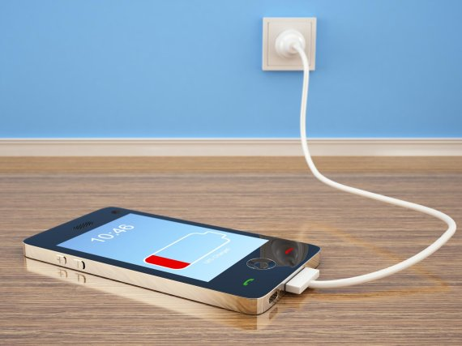
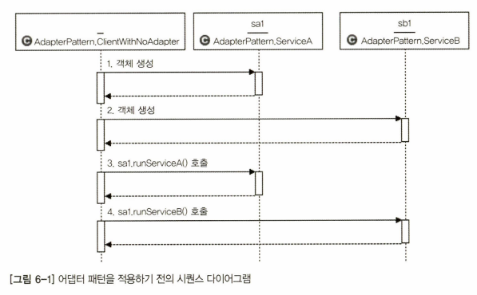
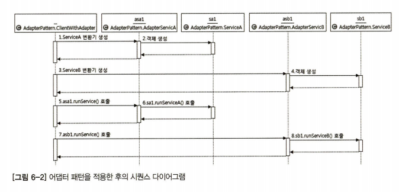
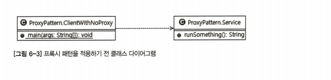
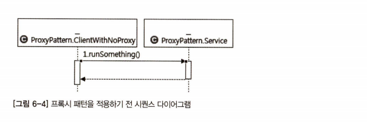
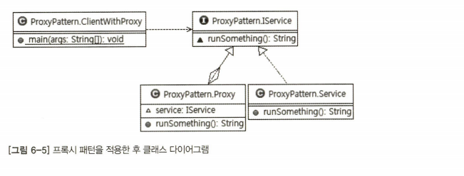

## 📌 목차

- 디자인패턴 개요
- 디자인패턴 종류
  - 어댑터 패턴
  - 프록시 패턴
  - 데코레이션 패턴
  - 싱글턴 패턴
  - 템플릿 메서드 패턴
  - 팩터리 메서드 패턴
  - 전략 패턴
  - 템플릿 콜백 패턴
  - 스프링이 사랑한 다른 패턴들(마무리)

## 01. 스프링이 사랑한 디자인패턴


> 현재까지 진행한 OOP의 개념

1. 객체 지향의 4대 특성
2. SOLID 5대 원칙
3. `디자인패턴`

**객체 지향 특성**은 **도구**, **설계 원칙**은 **도구를 올바르게 사용하는 방법**으로 비유.

| 요리                | 객체 지향 프로그래밍                   |
| ------------------- | -------------------------------------- |
| **요리도구**        | 4대 원칙(상속, 추상화, 다형성, 캡슐화) |
| **요리도구 사용법** | 5대 설계 원칙(SOLID)                   |
| `레시피`            | 디자인 패턴                            |

## 01-1. 디자인패턴이란?


- 프로그램을 작성하다보면 `비슷한 상황`을 직면하게 됨.
- 이러한 상황에서 이전의 많은 개발자들이 고민하고 정제한 `표준 설계 패턴`를 의미.

> 즉, 실제 개발 현장에서 다양한 요구사항을 프로그래밍으로 처리하면서 만들어진 다양한 해결책 중  
> 많은 사람들이 인정한 Best Practice를 정리한 것.

## 01-2. 스프링 프레임워크(Spring Framework)

> 스프링 프레임워크를 설명하는 공식정인 정의

- 자바 엔터프라이즈 개발을 편하게 해주는 **Open source application framework**
- **OOP 프레임워크**
- `스프링`은 `객체 지향`의 `특성과 설계 원칙`을 `극한`까지 적용한 프레임워크

## 02. 어댑터 패턴(Adapter Pattern)



> 💡 개발 폐쇄 원칙()을 활용한 설계 패턴

- 어댑터를 번역하면 `변환기`
- **서로 다른 두 인터페이스 사이에 통신을 가능하게 함**
- 대표적으로는 `휴대폰 충전기`가 존재
- ODBC(Open Database Connectivity), JDBC(Java Database Connectivity), JRE

### 02-1. 어댑터 패턴 적용 전

```java
// Before: Class ServiceA
public class ServiceA {
    void runServiceA() {
        System.out.println("ServiceA");
    }
}
```

```java
// Before: Class ServiceB
public class ServiceB {
    void runServiceB() {
        System.out.println("ServiceB");
    }
}
```

```java
// Before: Class ClientWithNoAdapter
public class ClientWithNoAdapter {

    public static void main(String[] args) {
        ServiceA sa1 = new ServiceA(); // 1. 객체 생성
        ServiceB sb1 = new ServiceA(); // 2. 객체 생성

        sa1.runServiceA(); // 3. sa1.runServiceA() 호출
        sb1.runServiceB(); // 4. sa1.runServiceB() 호출
    }
}
```

- 현재 sa1, sb1 참조 변수를 통해 runServiceA(), runServiceB() 메서드 호출
- 비슷한 일을 하지만 메서드명만 다른 것을 확인 가능

### 02-2. 시퀸스 다이어그램(Sequence Diagram)



### 02-3. 어댑터 패턴 적용 후

```java
// After: Class AdapterServiceA
public class AdapterServiceA {
    ServiceA sa1 = new ServiceA();

    void runService() {
        sa1.runServiceA();
    }
}
```

```java
// After: Class AdapterServiceB
public class AdapterServiceB {
    ServiceA sb1 = new ServiceB();

    void runService() {
        sb1.runServiceB();
    }
}
```

```java
// After: Class ClientWithAdapter
public class ClientWithAdapter {

    public static void main(String[] args) {
        AdapterServiceA asa1 = new AdapterServiceA();
        AdapterServiceB asb1 = new AdapterServiceB();

        sa1.runService();
        sb1.runService();
    }
}
```

- 클라이언트(ClientWithAdapter)가 변환기를 통해 동일한 메서드인 runService() 호출
- 즉, 직접 ServiceA, ServiceB의 메서드를 호출하는 것이 아닌 어댑터 객체를 통해 접근

### 02-4. 시퀸스 다이어그램(Sequence Diagram)



- 어댑터 패턴 `합성`, 즉 객체를 속성으로 만들어서 참조하는 디자인 패턴
- 호출 당하는 쪽의 메서드(**runServiceA**)를 중간 변환기(**AdapterServiceA**)를 통해 호출하는 패턴

## 03. 프록시 패턴(Proxy Pattern)


> 개방 폐쇄 원칙과 의존 역전 법칙이 녹아들어 있는 프록시 패턴

- 프록시는 대리자, 대변인의 뜻을 가진 단어
- 디자인 패턴에서는 대리자/대변인을 프록시 패턴으로 표현





- ClientWithNoProxy가 대리자(**프록시 객체**)없이 Service 객체의 runSomething() 직접 호출

### 03-1. 프록시 패턴 적용 전

```java
// Before: Class Service
public class Service {

    public String runSomething() {
        return "서비스를 실행합니다.";
    }
}
```

```java
// Before: Class ClientWithNoProxy
public class ClientWithNoProxy {

    public static void main(String[] args) {
        // 프록시를 이용하지 않은 호출
        Service service = new Service(); // 결합도 역시 올라감
        System.out.println(service.runSomething);
    }
}
```

- ClientWithNoProxy 클래스에서 Service 클래스의 메서드를 직접 호출.
- 위와 같은 코드를 A 가 B(ClientWithNoProxy)에 의존한다 할 수 있다.

### 03-2. 프록시 패턴



- 프록시 패턴의 경우 **실제 서비스 객체가 가진 메서드와 같은 이름의 메서드**를 사용
  - 이를 위해서 인터페이스 사용
- 인터페이스를 사용하면 서비스 객체가 들어갈 자리에 대리자 객체가 투입됨
- **클라이언트는 서비스객체를 호출하는지, 대리자 객체를 호출하는지 알 수가 없다.**

### 03-3. 시퀸스 다이어그램


1. ClientWithProxy 클래스에서 메서드 호출
2. BBB
3. CCC

### 03-4. 프록시 패턴 적용 후

```java
// After: Interface IService
public interface IService {
    String runSomething();
}
```

```java
// After: Class Service
public class Service implements IService {

    @Overried
    public String runSomething() {
        return "서비스를 실행합니다.";
    }
}
```

```java
// After: Class Proxy
// @desc : 💡 중간 대리자의 역할을 수행, 호출에 대한 변경이 아닌 제어가 주 목적이다
public class Proxy implements IService {
    IService service; // 인터페이스 IService의 참조 변수를 맴버로 갖는다

    @Overried
    public String runSomething() {
        System.out.println("호출에 대한 흐름 제어가 주목적, 반환 결과를 그대로 전달")

        // Bussiness Logic 수행 가능

        service = new Service();
        return service.runSomething();
    }
}
```

```java
// After: Class ClientWithProxy
public class ClientWithProxy {

    public static void main(String[] args) {
         // 다형성, 부모 객체로 자식 객체를 받음
         // ex) List<String> list = new ArrayList<>();
        IService proxy = new Proxy();
        System.out.println(proxy.runSomething());
    }
}
```

> 대리자의 역할, 여기서는 Proxy 클래스가 된다

1. 서비스와 같은 이름의 메서드 구현, 이때 인터페이스 사용
2. 실제 서비스에 대한 참조 변수를 갖음(**합성**)
3. 실제 서비스와 같은 이름을 가진 메서도 호출, 그 값을 반환
4. 실제 서비스의 **메서드 호출 전후에 별도의 로직 수행 가능**

### 한줄 정리

> ⭐ **제어 흐름을 조정하기 위한 목적으로 중간에 대리자를 두는 패턴**

## 04. 데코레이터 패턴(Decorator Pattern)


- 데코레이터는 **도장**, **도배업자**, `장식자`의 뜻을 가진 단어
- 즉, `원본에 어떠한 장식을 더하는 패턴`이라는 것이 이름에서 들어남
- 프록시 패턴과 구현 방법이 같으나, `클라이언트의 최종 반환값을 조작`

### 04-1. 프록시 패턴과 데코레이터 패턴 비교

- `프록시 패턴`
  - 제어의 흐름을 변경하거나 별도의 로직 처리 목적
  - 클라이언트의 반환 값을 특별한 경우가 아니면 변경하지 않음
- `데코레이터 패턴`
  - 클라이언트가 받는 반환값에 장식을 더한다
  - 즉, return 값을 핸들링 한다는 의미

### 04-2. 데코레이터 패턴 적용 후

```java
// After: Interface Iservice
public Interface IService {
    // public abstract 생략해도 상관 없음
    public abstract String runSomething();
}
```

```java
// After: Class Service
public class Service implements IService {

    @Overried
    public String runSomething() {
        return "추상 메서드 runSomething 호출!";
    }
}
```

```java
// After: Class Decoreator
public class Decoreator implements IService {
    IService service; // interface ref variable

    public String runSomething() {
        // System.out.println("호출에 대한 흐름 제어가 주목적, 반환 결과를 그대로 전달") // Proxy
        System.out.println("호출에 대한 장식이 목적, 클라이언트에게 반환 결과에 장식을 더하여 전달");

        service = new Service();

        // 유저의 반환 값을 프록시 단에서 핸들링
        return "정말" + service.runSomething();
    }
}
```

```java
public class ClientWithDecolator {

    public static void main(String[] args) {
        // 상위 인터페이스로 하위 Decorator 객체를 받는다
        IService decorator = new Decoreator();

        // How to call method?
        //  ㄴ decorator.runSomthine
        //      ㄴ service.runSomthine
        System.out.println(decorator.runSomething());
    }
}
```

> Class : Decorator => '장식자', Service => '서비스'

1. 장식자는 실제 서비스와 `같은 이름의 메서드` 구현, 이 때 인터페이스 사용
2. 장식자는 실제 서비스에 대한 `참조 변수`를 갖는다(합성)
3. 장식자는 `실제 서비스와 같은 이름을 가진 메서드 호출, 반환값을 조작 후 반환.`
4. 장식자는 실제 서비스의 메서드 `호출 전후에 비즈니스 로직 수행` 가능.

### 한줄 정리

> ⭐ 메서드 호출의 반환값에 변화를 주기 위해 중간에 장식자(Decorator)를 두는 패턴

## 05. 싱글턴 패턴(Singleton Pattern)

## 06. 템플릿 메서드 패턴(Template Method Pattern)

## 07. 팩터리 메서드 패턴(Factory Method Pattern)

## 08. 전략 패턴(Strategy Pattern)

## 09. 템플릿 콜백 패턴(Template Callback Pattern - 견본/회신 패턴)

## 10. 스프링이 사랑한 다른 패턴들(디자인패턴 마무리)

- 위 8가지 패턴 말고도 스프링은 다양한 디자인 패턴 활용.
- 대표적으로는 Spring MVC(Model, View, Controller) 패턴 존재.

### 참고 자료

- [[책 링크] 스프링 입문을 위한 자바 객체 지향의 원리와 이해](http://www.yes24.com/Product/Goods/22483294)
- [[사진 참고] Spring 이론 (POJO, Java Beans)](https://ksshlee.github.io/spring/spring/)
- [[사진 참고] IStock](https://www.istockphoto.com/kr/%EB%B2%A1%ED%84%B0/%EB%91%90-%EB%B2%A1%ED%84%B0-%ED%81%AC%EB%A6%AC%EC%8A%A4%EB%A7%88%EC%8A%A4-%ED%8A%B8%EB%A6%AC%EC%9E%85%EB%8B%88%EB%8B%A4-%ED%81%AC%EB%A6%AC%EC%8A%A4%EB%A7%88%EC%8A%A4-%ED%8A%B8%EB%A6%AC-%EA%BE%B8%EB%AF%B8%EA%B8%B0-%EC%A0%84%ED%9B%84-%ED%81%AC%EB%A6%AC%EC%8A%A4%EB%A7%88%EC%8A%A4-%EC%9E%A5%EC%8B%9D-%ED%94%8C%EB%9E%AB-%EA%B3%A0%EB%A6%BD-%EB%90%9C-%EA%B7%B8%EB%A6%BC%EC%9E%85%EB%8B%88%EB%8B%A4-gm1064483898-284620235)
- [[사진 참고] How Do I Setup A Proxy Server On Windows PC?](https://streamtelly.com/proxy-server-windows/)
